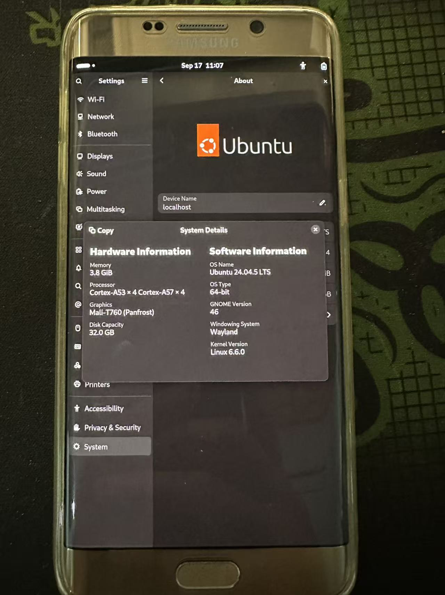

# zenlte-linux6 — Samsung Galaxy S6 Edge+ (SM-G9280) mainline Linux 6.6

在 **Samsung Galaxy S6 Edge+ (SM-G9280, 代号 zenlte, Exynos7420)** 上跑 mainline Linux 6.6 +
Ubuntu 24.04 (arm64) + GNOME 46 的移植工作，重点记录 **显示 IOMMU/SYSMMU**、
**GPU (Panfrost/Mali-T760) 硬件加速** 和 **触摸交互** 的攻坚过程。

> 主线内核本身不支持这台机器，本仓库包含了使其可用所需的全部内核改动、
> 打包工具、可刷写镜像和完整的技术文档。



*SM-G9280 (Exynos7420) 运行 Ubuntu 24.04.5 LTS + GNOME 46 (Wayland) + Linux 6.6.0，
显卡识别为 Mali-T760 (Panfrost)，8 核 (4×Cortex-A53 + 4×Cortex-A57)。*

---

## 里程碑（已实现）

| 功能 | 状态 | 说明 |
|---|---|---|
| 启动 (Exynos7420, 8×CPU) | ✅ | mainline 6.6.0 + Ubuntu 24.04 arm64 |
| WiFi (BCM4359 PCIe) | ✅ | `exynos7420-pcie` + brcmfmac |
| 蓝牙 (BCM4349B1) | ✅ | UART4/LPASS + AUD pad retention |
| 触摸 (stmfts) | ✅ | 点击 / 手势 / 2x 缩放 |
| **显示 IOMMU/SYSMMU** | ✅ | DECON `13930000.decon` → SYSMMU `13a00000`/`13a10000` |
| **GPU 硬件加速 (Panfrost)** | ✅ | Mali-T760，Mutter GPU 合成 + `glmark2` 900+ FPS |
| GNOME 桌面 | ✅ | Wayland，`gnome-shell --display-server` |
| 浏览器 / 桌面应用 | ✅ | 见「已知限制」 |
| 音频 | ⚠️ | 见 `docs/HANDOVER-audio.md` |

## 关键突破

### 1. 显示 IOMMU/SYSMMU（`patches/` 里的 `exynos-iommu.c`、`exynos7.dtsi`）
Exynos7420 的 DECON 走 SYSMMU v6。mainline 驱动无法直接工作，修复点：

- **probe 不读版本寄存器**（DISP 域未上电时读会挂总线）→ 静态 `MAKE_MMU_VER(6,0)` + `sysmmu_v5_variant`
- **`owner->ready` 延迟使能**：DECON runtime-resume 时不使能 SYSMMU，等 DECON 驱动确认
  已编程 IOVA framebuffer 后再调 `exynos_iommu_master_ready()`
- **恒等映射 bootloader framebuffer**（原厂 `iovmm_map_oto` 语义）：`exynos_iommu_map_identity()`，
  让 SYSMMU 一开始翻译时 DECON 读旧物理地址也正确
- **SYSMMU 挂 `master` 时钟**（= DECON aclk），否则 CCF 使能 pclk 时挂总线
- **SYSMMU fault 非致命**（对齐原厂 `disp_driver_fault_handler`）
- **DECON 驱动移除冲突的 simpledrm**（`drm_aperture_remove_framebuffers()`），
  否则 GNOME 看到两个显示设备 → 触摸映射/缩放错乱

### 2. DECON 三缓冲（`exynos7_drm_decon.c`）
驱动设了 `WINCONx_TRIPLE_BUF_MODE` 却只写 `VIDW_BUF_START`(0x80)，
未写 `BUF_START1/2`(0x84/0x88) → 每次重绘显示旧帧（闪烁）。补写同一地址即可。

### 3. GPU（`clk-exynos7.c`、`exynos7.dtsi`、Mesa）
Mali-T760 r0p1 在 mainline 下会 `gpu sched timeout` / `js fault`（fragment job 卡死、tile 重影）：

- **GPU `bus` 时钟**：给 `gpu@14ac0000` 加 `clock-names = "core","bus"`，
  `bus` = `CLK_PCLK_SYSREG_G3D`（原厂会开，mainline 从未开）
- **GPU async-bridge 时钟**：补 `aclk_lh_g3d0/1`（CMU_CCORE `ENABLE_ACLK_CCORE0` bit22/23，
  `CLK_IS_CRITICAL`）
- **Mesa 侧**：`PAN_MESA_DEBUG=noafbc,nocrc`（禁用 AFBC 与事务消除/CRC）
- 合成器（Mutter）走 GPU；GTK4/WebKit 应用当前用 `GSK_RENDERER=cairo` 软件渲染以保证无重影

### 4. 其它
- 触摸：关闭 `scale-monitor-framebuffer` 实验特性（2x 缩放下触摸映射错乱）
- `pd_disp` 是雷：mainline genpd 缺原厂 TZPC SMC，不能挂 `power-domains`
- DT 必须打包成 **DTBH 容器**（`tools/mkdtbh.py`）

## 仓库结构

```
patches/    内核改动 patch（相对 v6.6）+ 设备 defconfig
artifacts/  可刷写镜像（boot_bt_iommu*.img）与内核模块（.ko）
tools/      mkbootimg/mkdtbh（打包）、acm.py/send_b64.py（串口）
docs/       交接文档、进度记录、技术分析
rootfs/     设备侧配置（.bash_profile、monitors.xml 等）
```

## 构建 / 刷写

```bash
# 构建（需 aarch64 工具链；路径不能含空格）
T=/path/to/linux-6.6
export HOSTCFLAGS="-I.../hostinclude -I.../openssl@3/include"
export HOSTLDFLAGS="-L.../openssl@3/lib"
cd $T && gmake ARCH=arm64 CROSS_COMPILE=<toolchain>/bin/aarch64-linux-gnu- -j8 Image modules dtbs

# 打包（DT 改动必须先转 DTBH）
python3 tools/mkdtbh.py $T/arch/arm64/boot/dts/exynos/exynos7420-zenlte.dtb new_dt.img
python3 tools/mkbootimg_7420.py $T/arch/arm64/boot/Image <ramdisk.cpio.gz> new_dt.img boot.img

# 刷写（TWRP + adb）
adb push boot.img /tmp/boot.img
adb shell "dd if=/tmp/boot.img of=/dev/block/sda7 bs=4096; sync"
```

## 已知限制

- **Panfrost (Mali-T760 r0p1)** 在 mainline 下仍有深层问题：GPU 渲染的 GTK4/WebKit 表面
  在窗口化合成时可能出现重影/堆叠。当前通过 `GSK_RENDERER=cairo` 让这些应用走软件渲染
  （合成器仍 GPU 加速），保证完全无瑕疵。`patches/` 已含 GPU bus/async-bridge 时钟修复，
  可继续在此基础上深挖（`aclk_lh_g3d0/1` 已补，后续可考虑完整 G3D 电源域序列）。
- `boot_bt_iommu19.img` 含 async-bridge 时钟修复，尚未实测。
- 设备当前无网络自动连接；串口传输大文件较慢。

## 硬件

- SoC: Samsung Exynos7420 (4×Cortex-A57 + 4×Cortex-A53)
- GPU: ARM Mali-T760 MP8
- 显示: 1440×2560 MIPI-DSI 命令模式 (i80), DECON `13930000`, SYSMMU `13a00000`/`13a10000`
- 触摸: STMicroelectronics stmfts (i2c-2 @0x49)
- WiFi/BT: Broadcom BCM4359 (PCIe) / BCM4349B1 (UART4)

## 联系 / Contact

- 邮箱 / Email: **1018514521@qq.com**

欢迎交流 Exynos7420 / mainline Linux / Panfrost 相关问题。
